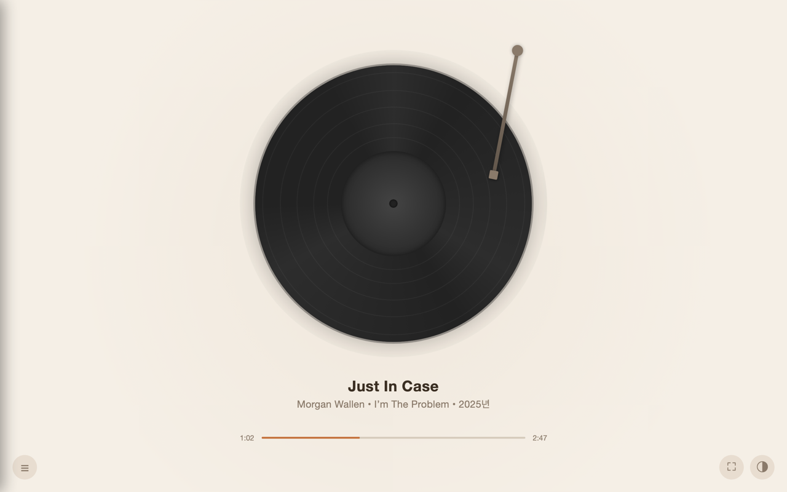
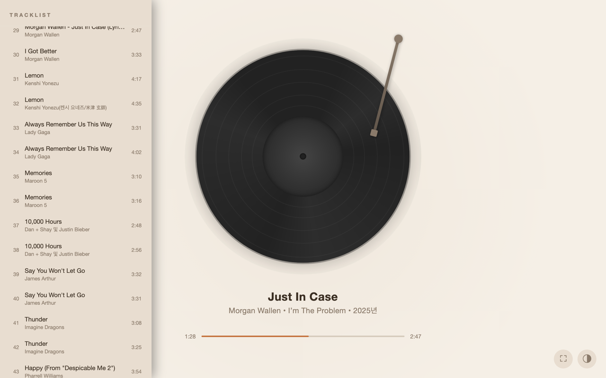
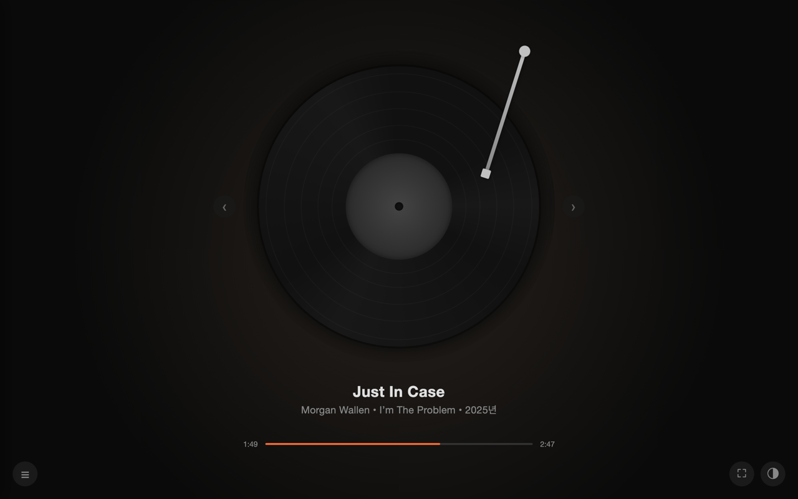

# LP Player for YouTube Music

A Chrome extension that transforms YouTube Music into a beautiful vinyl record player visualization.

## Features

- Vinyl record animation with album art on the label
- Draggable tonearm to play/pause
- Previous/Next track with record swap animation
- Tonearm tracks playback progress across the record
- Tracklist panel to browse and switch songs
- 4 themes: Dark, Warm, Cafe, Minimal
- Fullscreen support (button or double-click)
- Wake Lock to prevent screen sleep during playback

## Install

### Chrome Web Store

[Install from Chrome Web Store](https://chromewebstore.google.com/detail/lp-player-for-youtube-mus/ldogpimidicimdbhdpedmibkbgegcloh)

### Manual Install (Developer Mode)

1. Clone or download this repository
2. Open `chrome://extensions` in Chrome
3. Enable **Developer mode** (top right)
4. Click **Load unpacked** and select the project folder
5. Open YouTube Music and play a song
6. Click the extension icon → **Open LP Player**

## Usage

| Action | How |
|---|---|
| Play / Pause | Click or drag the tonearm |
| Previous / Next track | Click ‹ › buttons on turntable sides |
| Browse tracks | Click ☰ (bottom left) |
| Switch song | Click a track in the tracklist |
| Change theme | Click ◐ (bottom right) |
| Fullscreen | Click ⛶ or double-click anywhere |

## Support

If you enjoy this extension, consider supporting the project:

[Buy me a coffee on Ko-fi](https://ko-fi.com/lazyer96768)

## License

MIT
